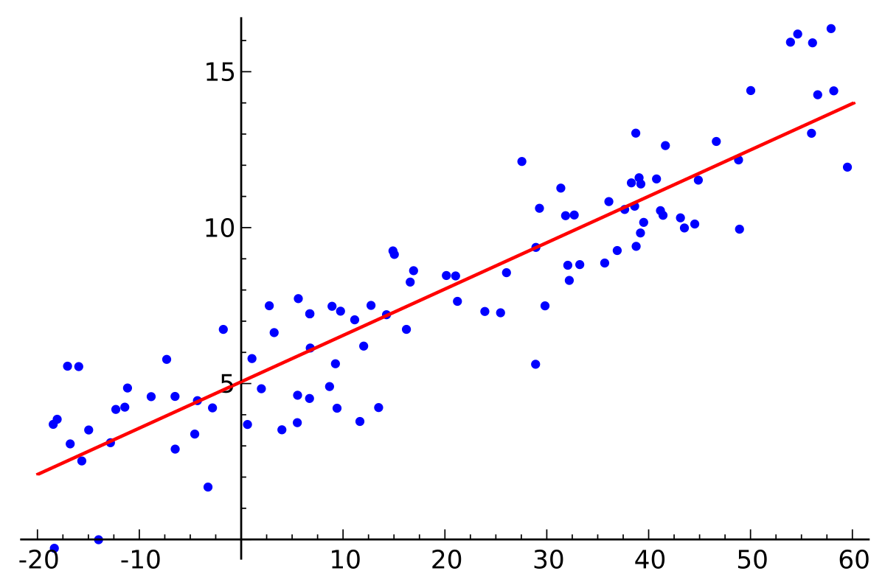

## The Linear Regression Algorithm

The **linear regression algorithm** is a linear approach to modeling the relationship between a scalar response (or dependent variable) and one or more explanatory variables (or independent variables). The case of one explanatory variable is called **simple linear regression**. For more than one explanatory variable, the process is called multiple linear regression. [Wikipedia](https://en.wikipedia.org/wiki/Linear_regression) 

The Linear Regression is one of the most basic and popular machine learning algorithm you will come across in your pursuit of a career as a data scientist or a machine learning engineer. It is intuitive and has a good range of uses and it's pretty straight forward and easy to understand.



So what problem does linear regression solve? Well when the target variable we're trying to predict is continuous, then such learning problem is a regression problem, thus the linear regression algorithm is used to solve continuous problems.

The linear regression algorithm was implemented in [linear_regression.py](linear_regression.py) and you can reference this [notebook](Linear%20Regression%20Notebook.ipynb) for more practical details on how the linear regression algorithm works. The focus was on implementing a simple linear regression with one explanatory variable `f(x) = mx + b`.

<br>

The class `LinearRegression` which contains several variables & methods (public and private) to carry out the relationships modeled using a linear predictor functions.

```python
class LinearRegression:
    def __init__(self, x, y, alpha=0.01, num_iter=1000, verbose=False):
        pass
```

At initialization of the Linear Regression model:

- `x` will be the input feature which should be a (X<sup>m</sup>, 1) matrix.
- `y` will be the target feature which should be a (Y<sup>m</sup>, 1) matrix.

`alpha` is the learning rate and `num_iter` the number of iterations used in gradient descent. `verbose` if True will produce the detailed output of the cost function for diagnostic purposes.

**NB:** "m" is the number of training examples.

The choice of numpy array was to perform vectorization on the data, thus avoiding the constant use of excessive for loops and thus optimizing the program.

The Hypothesis of a simple linear regression is given as:
h<sub>&theta;</sub>(x) = &theta;<sub>o</sub> x + &theta;<sub>1</sub>x
where x is the input variable.

The cost function or **mean squared error** is used to measure the accuracy of our hypothesis. This takes the average difference of all the result of the with the inputs from and the actual output y's.

The mean of the cost function is halved as a convenience for the computation of gradient descent. 

```python
def fit(self, timeit=True, count_at=100):
    pass
```

So when we have our hypothesis function and we have a way of measuring how well it fits into the data. We then need to estimate the parameters in the hypothesis function and this is where **Gradient Descent** comes in and this process goes on for a period of time until the cost converge to a global minimum.

Follow me on **Twitter** [@GM_Olalekan](https://twitter.com/GM_Olalekan?s=09)
